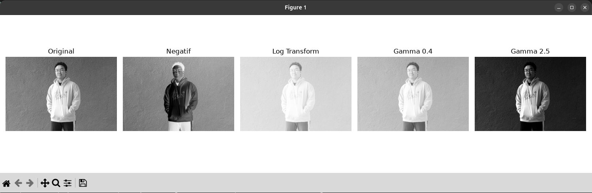
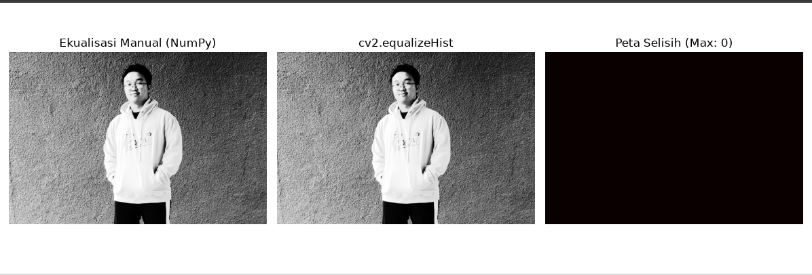
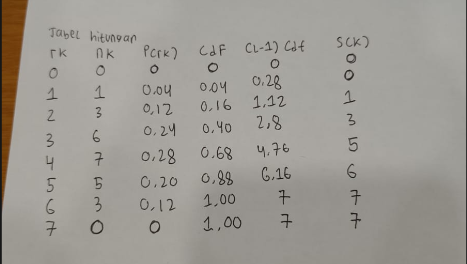

# Laporan Pengolahan Citra dan Video
## Pertemuan 2: Transformasi Intensitas & Peningkatan Citra

---

### Data Praktikan
* **Nama**        : Darren Dexter Thio
* **NRP**         : 5024241006
* **Kelas**       : Pengolahan Citra dan Video A
* **Departemen**  : Teknik Komputer - FTEIC ITS
* **Dosen Pengampu**: Ir. Arta Kusuma Hernanda, S.T., M.T.

---

## 1. Transformasi Intensitas Berbasis LUT

> **Referensi Kode:** `2-ti-eq.py`

### 1.1 Hasil Visualisasi


### 1.2 Analisis Hasil Transformasi
* **Citra Negatif ($s = 255 - r$):**
  Citra negatif mengubah nilai kebalikan dari value original, sehingga kalau gelap berubah menjadi terang, dan citra terang dibalik menjadi gelap.
* **Transformasi Log ($s = c \cdot \ln(1 + r)$):**
  Tujuan dari transformasi logaritme adalah mengubah warna yang gelap dinaikkan menjadi lebih terang (jadi menaikkan warna, serta menetralkan warna putih)
* **Koreksi Gamma $\gamma = 0.4$ ($\gamma < 1$):**
  Tujuan dari transformasi gamma kalau lebih kecil dari 1, adalah mengubah warna menjadi lebih terang
* **Koreksi Gamma $\gamma = 2.5$ ($\gamma > 1$):**
  sedangkan dari gamma lebih besar dari 2.5, mengubah warna menjadi lebih gelap.

---

## 2. Cacah Histogram Manual vs `np.bincount`

> **Referensi Kode:** `src/tugas2_histogram.py`

### 2.1 Bukti Verifikasi Numerik
Hasil pengujian kesamaan array antara perulangan manual dan fungsi bawaan:

```text
Eksekusi pengujian histogram:
- np.array_equal(hist_loop, hist_bincount) : True
- Total selisih absolut antar-bin         : 0
- Total piksel terhitung (Loop manual)    : [Contoh: 262144]
- Total piksel terhitung (np.bincount)    : [Contoh: 262144]
- Dimensi citra (M x N)                   : [Contoh: 512 x 512 = 262144]
```

## 3. Ekualisasi Histogram Manual

> **Referensi Kode:** `2-ti-eq.py`

### 3.1 Tahapan Perhitungan
1. Hitung histogram $h(r_k) = n_k$ dari citra masukan.
2. Normalisasi menjadi peluang $p(r_k) = n_k / MN$.
3. Hitung CDF kumulatif: $\text{cdf}(k) = \sum_{j=0}^{k} p(r_j)$.
4. Petakan ke intensitas baru: $s_k = \text{round}\big((L-1)\cdot \text{cdf}(k)\big)$.
5. Terapkan hasil pemetaan sebagai LUT ke seluruh piksel citra.

### 3.2 Hasil Visualisasi


[Sertakan minimal: citra asli, citra hasil ekualisasi manual, dan histogram sebelum/sesudah berdampingan]

### 3.3 Perbandingan dengan `cv2.equalizeHist`

```text
Eksekusi pengujian ekualisasi:
- Selisih maksimum piksel (manual vs cv2.equalizeHist) : [Contoh: 1]
- Selisih rata-rata piksel                              : [Contoh: 0.03]
- Jumlah piksel berbeda dari total                      : [Contoh: 512 dari 262144]
```

**Analisis Perbedaan:**
perbedaan yang bisa dihasilkan oleh kedua fungsi ini, antara built in dari opencv, atau hitung manual adalah disebabkan oleh value + 0,5 dari hitungan manual yang tujuan untuk melakukan flooring value.
---

## 4. Tabel Manual Ekualisasi (Citra 3-bit)

> **Data:** $n_k$ sesuai yang dibagikan oleh dosen pengampu (L = 8 level, 3 bit)

### 4.1 Tabel Perhitungan

| $r_k$ | $n_k$ | $p(r_k)$ | cdf | $(L-1)\cdot\text{cdf}$ | $s_k$ |
| --- | --- | --- | --- | --- | --- |
| 0 | [ 0 ] | [ 0 ] | [ 0 ] | [ 0 ] | [ 0 ] |
| 1 | [ 1 ] | [ 0.04 ] | [ 0.04 ] | [ 0.28 ] | [ 0 ] |
| 2 | [ 3 ] | [ 0.12 ] | [ 0.16 ] | [ 1.12 ] | [ 1 ] |
| 3 | [ 6 ] | [ 0.24 ] | [ 0.40 ] | [ 2.80 ] | [ 3 ] |
| 4 | [ 7 ] | [ 0.28 ] | [ 0.68 ] | [ 4.76 ] | [ 5 ] |
| 5 | [ 5 ] | [ 0.20 ] | [ 0.88 ] | [ 6.16 ] | [ 6 ] |
| 6 | [ 3 ] | [ 0.12] | [ 1.00 ] | [ 7 ] | [ 7 ] |
| 7 | [ 0 ] | [ 0 ] | [ 1.00 ] | [ 7 ] | [ 7 ] |

### 4.2 Foto Perhitungan Tulis Tangan


